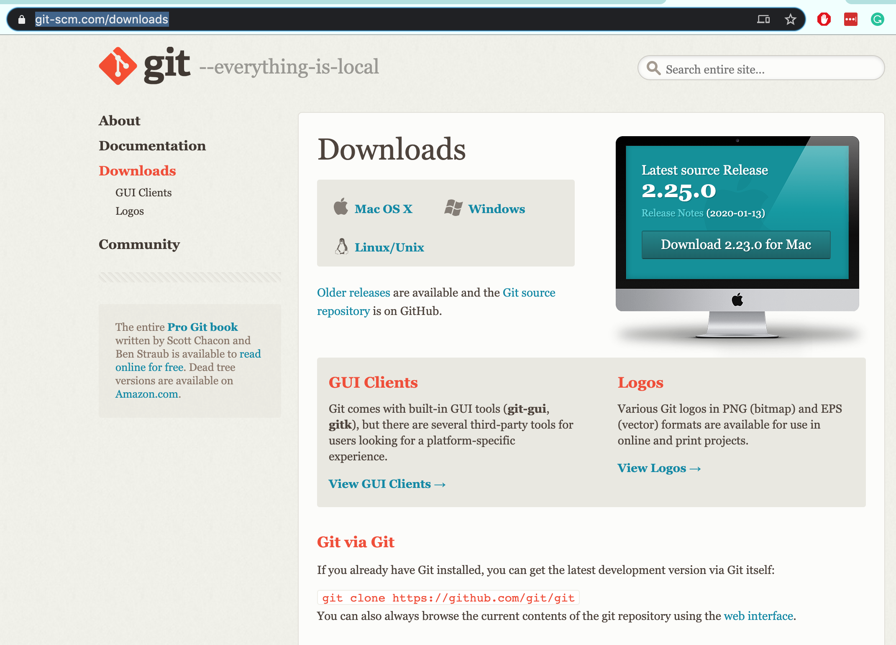
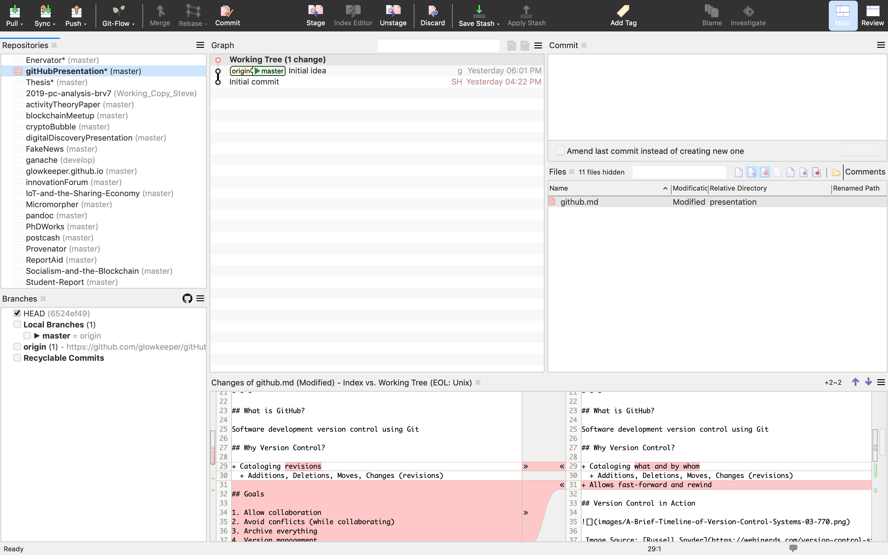
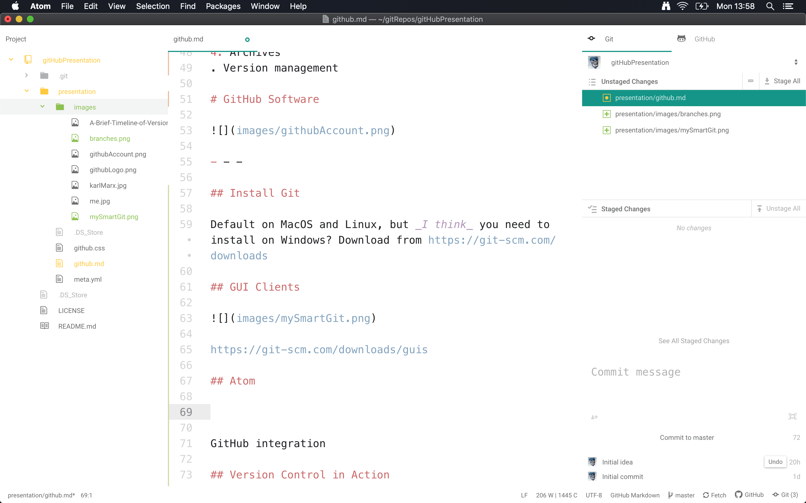

#  An Introduction to GitHub

(Dr) Steven Huckle

- - -

## Objectives

- Introduce GitHub
- Demonstrate Using GitHub
- Summarise the Advantages of GitHub

#  GitHub

_Image Source: [GitHub](https://github.com)_

- - -

## What is GitHub?

Hosts _git_ repositories

## What is git?

Distributed (software) _version control_ - people work locally, then push and pull changes to and from GitHub.

## What is Version Control?

+ Which changes were made?
+ Who made the changes?
+ When were the changes made?
+ Why were changes needed?

## e.g

_Image Source: [git-scm.com](https://git-scm.com/about)_

## Goals

1. Change management
2. Collaboration
3. Conflict control (while collaborating)
4. Archives
. Version management

# GitHub Software

_Image Source: [https://git-scm.com/](https://git-scm.com/downloads/guis)_

- - -

## Install Git

Default on MacOS and Linux, but _I think_ you need to install on Windows? Download from https://git-scm.com/downloads

## GUIs

[https://git-scm.com/downloads/guis](https://git-scm.com/downloads/guis)

## Atom

# Using GitHub

- - -

## Repository

Encompasses the entire collection of files and folders associated with a project, along with each file’s revision history

## The Very First Thing You Should Do

_Pull!_

## Adding Files

1. Stage
2. Commit
3. Push

## Branching

_Image Source: [medium](images/https://medium.com/devsondevs/gitflow-workflow-continuous-integration-continuous-delivery-7f4643abb64f)_

## Pull Requests

Lets you tell others about changes you've pushed to a branch in a repository on GitHub

## Merging

_Image Source: [stackoverflow](https://stackoverflow.com/questions/55730292/how-git-maintains-commits-from-deleted-branch)_

# Summary

- - -

# Links

1. [This presentation](https://tinyurl.com/y5f59m85): https://tinyurl.com/y5f59m85
2. [git](https://git-scm.com/): https://git-scm.com/
3. [git Handbook](https://guides.github.com/introduction/git-handbook/)
4. [GitHub](https://github.com/): https://github.com/
5. [GitHub help](https://help.github.com/en): https://help.github.com/en
6. [GitHub Learning Lab](https://lab.github.com/)

- - -

# Thank You

w: [glowkeeper.github.io](https://glowkeeper.github.io/)

e: s.huckle@sussex.ac.uk
