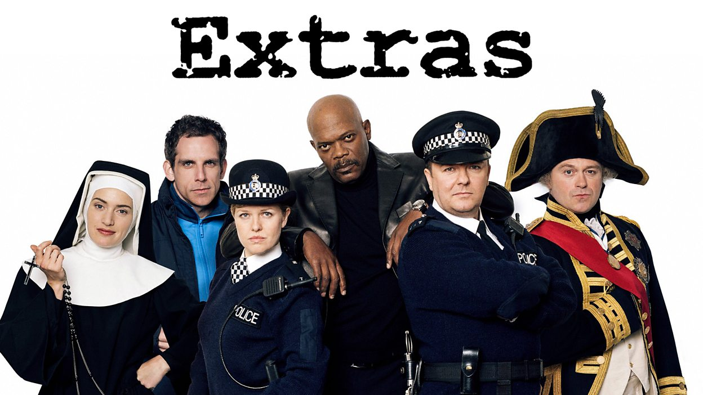

#  An Introduction to GitHub


(Dr) Steven Huckle

s.huckle@sussex.ac.uk

- - -

# GitHub


_Image Source: [GitHub](https://github.com)_

- - -

## What is GitHub?

Hosts _git_ repositories

## What is git?

Distributed (source code) _version control_ - people work locally, then push and pull changes to and from GitHub

## What is Version Control?

+ Which _changes_ were made?
+ Who made the _changes_?
+ When were the _changes_ made?
+ Why were _changes_ needed?

## Goals

1. Manage _change_ (versioning)
2. Collaboration
4. Archive

# Git Software


_Image Source: [https://git-scm.com/](https://git-scm.com/downloads/guis)_

- - -

## git

Installed by default on MacOS and Linux, but on Windows, _I think_ you need to install `git`? Download from [https://git-scm.com/downloads](https://git-scm.com/downloads)

## GUIs


[https://git-scm.com/downloads/guis](https://git-scm.com/downloads/guis)

## Atom


# Using GitHub


- - -

## Repository

Encompasses the entire collection of files and folders associated with a project, along with each file’s revision history

## Branching


_Image Source: [medium](images/https://medium.com/devsondevs/gitflow-workflow-continuous-integration-continuous-delivery-7f4643abb64f)_

## Working on Open Source Projects

1. Fork the GitHub repository and clone it to local machine
2. Check out master branch
3. Create topic branch
4. Write patches
5. Stage and Commit patches
6. Push the new branch back up to the GitHub fork
7. Send a Pull Request

## Keeping Your Fork in Sync

```
git remote add upstream https://github.com/ORIGINAL_OWNER/ORIGINAL_REPOSITORY.git
```
e.g:
```
git remote add upstream https://github.com/glowkeeper/gitHubPresentation.git
```

## Adding Files (to GitHub)

1. Stage
2. Commit
3. **Push**

## Pull Requests

Tell others about changes you've pushed to a branch in a repository on GitHub

## Merging


_Image Source: [stackoverflow](https://stackoverflow.com/questions/55730292/how-git-maintains-commits-from-deleted-branch)_

## A Note from the Wise

Before you do _ANYTHING_ else:

**Pull**

(or know why not to **Pull**)

#



- - -

## Project Management


## Wiki


## GitHub Actions

Continuous integration

# Summary

+ GitHub, `git` and version control
+ Repositories
  + Forking, Pull requests
  + Branching (gitFlow), staging, commiting, merging
+ GitHub extras
  + Project management, wiki, project integration

- - -

# Links

+ [This presentation](https://github.com/glowkeeper/gitHubPresentation): https://github.com/glowkeeper/gitHubPresentation
+ [git](https://git-scm.com/): https://git-scm.com/
+ [git Handbook](https://guides.github.com/introduction/git-handbook/)
+ [GitHub](https://github.com/): https://github.com/
+ [GitHub help](https://help.github.com/en): https://help.github.com/en
+ [GitHub Learning Lab](https://lab.github.com/)

- - -

# Thank You

(Dr) Steven Huckle

w: [glowkeeper.github.io](https://glowkeeper.github.io/)

e: s.huckle@sussex.ac.uk
